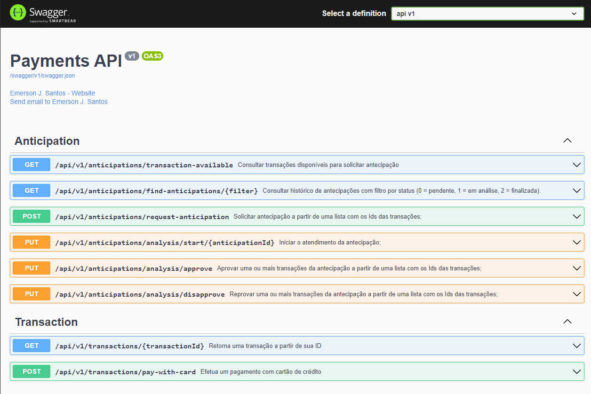

# api-payments
Uma api que simula transações de cartão de crédito com parcelas e antecipação de recebíveis

https://github.com/paggcerto-sa/desafios/blob/master/back-end.md

# Tecnologias Utilizadas
* Asp .Net Core 5 + Entity Framework Core
* Microsoft SQL Server 2019

# Dependências
* Microsoft .NET SDK 5.0.4
* SQL Server 2019

## Iniciando
1. Clone ou baixe este repositório
3. Vá para o diretorio **src/api** e execute o comando `dotnet build` para compilar o projeto e todas as suas dependências. 
4. Configure a ConnectionStrings do banco de dados em **appsettings.js**
5. Execute o comando `dotnet ef migrations add InitialCreate` para criar a primeira migração do banco de dados
6. Execute o comando `dotnet ef database update` para criar o banco de dados
7. Execute o comando `dotnet run`
8. Navegue até https://localhost:5001/index.html para visualizar a pagina do SwaggerUI

## 

  

